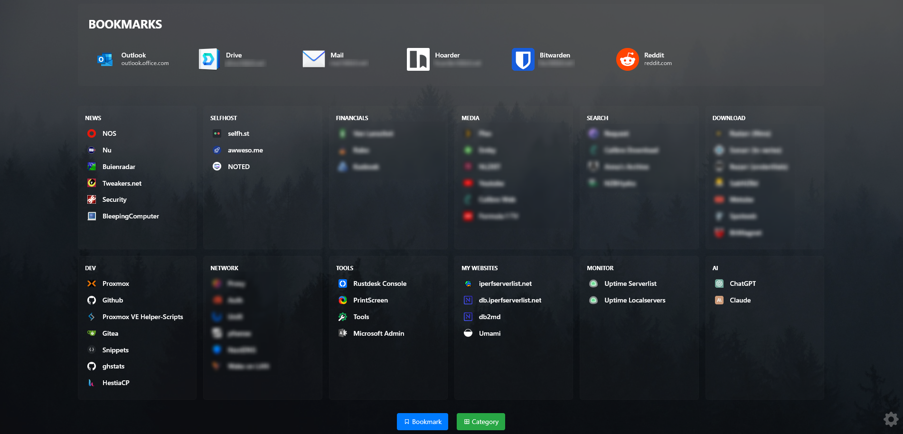

# Bookmarkly

Bookmarkly is a self-hosted bookmark application that allows users to organize and manage their favorite websites and applications.

## Table of Contents
- [Demo](#demo)
- [Features](#features)
- [Installation](#installation)
  - [Traditional Setup](#traditional-setup)
  - [Docker Setup](#docker-setup)
- [First Time Setup](#first-time-setup)
- [Important Notes](#important-notes)

## Demo
Coming soon...

## Screenshots

[Manage bookmarks](screenshots/2_manage_bookmarks.png) - [Bookmark](screenshots/3_bookmark.png) - [Settings](screenshots/4_settings.png)
   

## Features

### :pushpin: Bookmark Management 
- Responsive design for desktop & mobile access
- Organize bookmarks into categories
- Mark bookmarks as favorites
- Customize each bookmark with its own icon

### :art: Personalization 
- Multiple themes
- Customizable background image with brightness and saturation controls
- Custom CSS support for styling control
- Multilingual interface

### :bulb: Icon System  
- Integrated icon finder with predefined app icons
- Automatic favicon extraction from websites
- Custom icon upload support

### :closed_lock_with_key: Security
- Password-protected login system
- Configurable "Remember me" functionality
- Optional dashboard protection for extra security 

### :gear: Administration
- User-friendly admin interface
- Comprehensive settings panel
- Debug mode for troubleshooting

## Installation

### Requirements
- Web server (Apache/Nginx)
- PHP 7.4 or higher

### Traditional Setup

1. **Download and Upload**
   - Download Bookmarkly from: https://bookmarkly.nl/download/bookmarkly_1.4.zip
   - Upload to your web server (e.g., `/var/www/bookmarkly`)

2. **Set Permissions**
   ```bash
   chmod 755 /var/www/bookmarkly
   chmod 777 /var/www/bookmarkly/data    # Database directory
   chmod 777 /var/www/bookmarkly/uploads # Icon uploads directory
   ```

3. **Configure Web Server**
   ```apache
   # Apache configuration example (.htaccess)
   <Directory /var/www/bookmarkly/public>
       AllowOverride All
       Require all granted
   </Directory>
   ```

4. :bangbang: **Security Recommendations** :bangbang:
   - Ensure only the `public` directory is web-accessible
   - Store the `data` directory outside the web root if possible

### Docker Setup

**Pull the Image**
```bash
docker pull ghcr.io/r0gger/bookmarkly:latest
```

**Run with Docker**
```bash
docker run --name bookmarkly \
  -d \
  --restart always \
  -p 80:80 \
  -v bookmarkly_data:/var/www/html/bookmarkly/data \
  ghcr.io/r0gger/bookmarkly:latest
```

**Docker Compose**
```yaml
services:
  bookmarkly:
    image: ghcr.io/r0gger/bookmarkly:latest
    ports:
      - "80:80"
    volumes:
      - bookmarkly_data:/var/www/html/bookmarkly/data
    restart: unless-stopped
    healthcheck:
      test: ["CMD", "curl", "-f", "http://localhost/"]
      interval: 30s
      timeout: 10s
      retries: 3
      start_period: 10s

volumes:
  bookmarkly_data:
```

## First Time Setup

1. **Access the Application**
   - Visit: `https://your-domain.com` or `http://192.168.1.123` (example)
   - Click the gear icon in the bottom right

2. **Default Credentials**
   - Username: `admin`
   - Password: `password`

3. :bangbang: **Important Security Step** :bangbang:
   - Immediately change the default credentials
   - Click the gear-icon :gear: (bottom-right)
   - Go to Settings > Change Username / Change Password

## Important Notes

⚠️ **Please be aware:**
- This project is under active development
- Features and functionality may change
- Report any bugs or issues on GitHub
